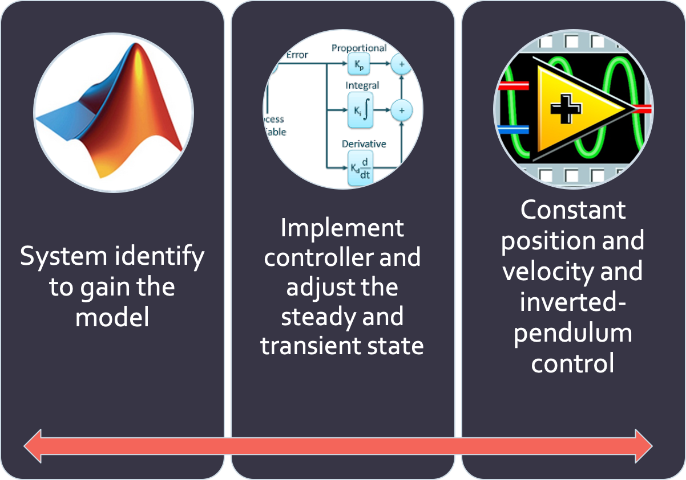
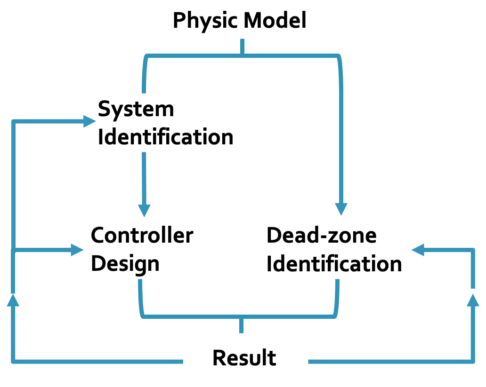
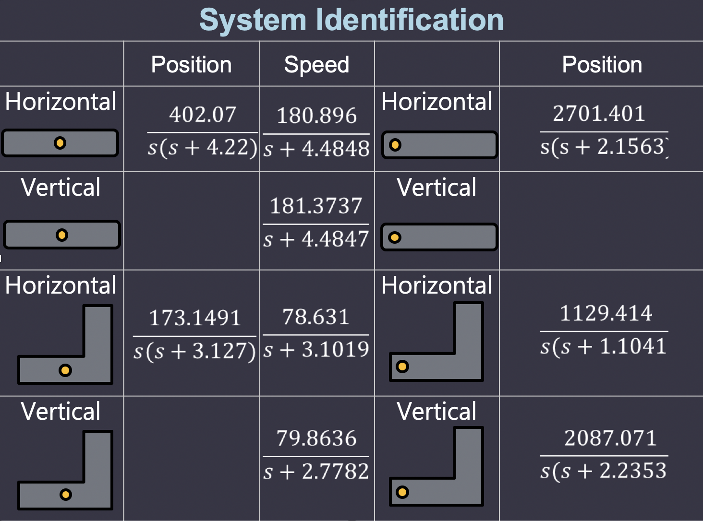

# Control and Model Identification
## Introduction

The experiment is about doing system identification of the inverted pendulum and designing the corresponding controller. In addition, we further deal with the motor dead zone by completing several experiments on the system. 

## Flowchart

## System Identification
We considered first and second order model to fit our system. We wanted to construct all of the models corresponding to several situations as shown in the picture. 

### Problem:

However, as long we tried several experiments, the results are inconsistent with the first and second order model. To solve the problem, we implemented dead-zone identification as mentioned below.
1. The influence of **gravity** and **friction** leads to the inaccuracy when doing specific position and velocity control at small angle.
2. The steady state error would then raise with respect to the inaccuracy. 
3. The effectiveness of the designed controller would decreased. 

### Solution: Dead Zone Identification
1. At first we consider the main influence being the gravity, thus reckoning it as a sine function. 
2. However, the influence of friction affects much more than we expect and thus deciding to use real experiment measurement. 
3. According to different starting positions of the block, 
#### Experiment
STEP 1:
STEP 2:
STEP 3:

## Controller Design
